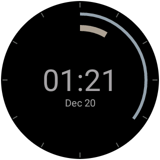

ArcWatch
========

Minimalistic Android Wear watchface for round and square watches.
Represents hour and minute pointers as arcs of varying lengths. The watchface supports both burn-in protection and low-bit mode for watches that use these.

TODO:
- Configurable colors, position and size of arcs

Suggestions and feature requests are welcome!
